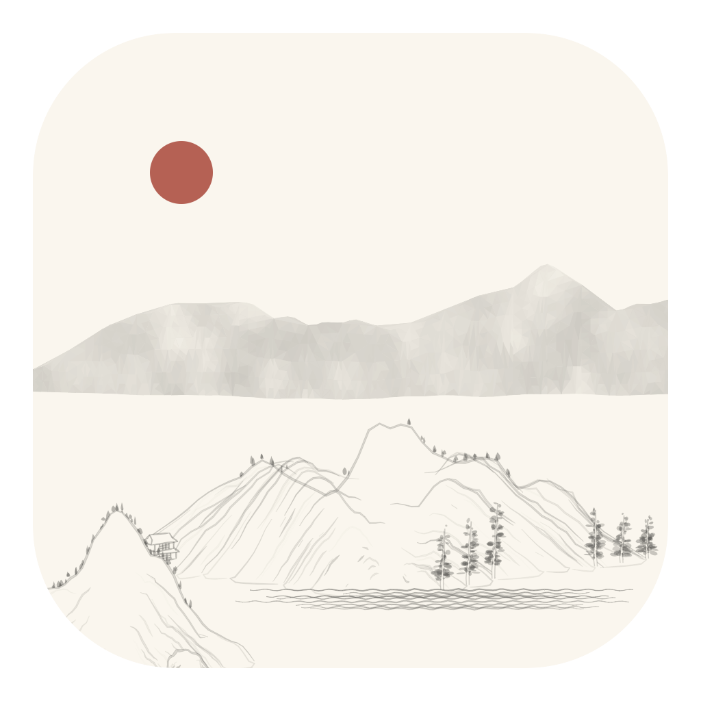

# GroundSurf



Endlessly generated Chinese landscape wallpaper for your Mac. GroundSurf by **Akhilesh Khajuria**, based on [Lingdong Huang's shan-shui-inf](https://github.com/LingDong-/shan-shui-inf).

Works offline. Full-detail procedural art, gentle continuous scrolling, one scene per display, and a menu bar with Pause/Resume, speed controls, New Landscape, About, and Quit. Old scenery is discarded behind the view. Quitting reveals your existing wallpaper.

## Windows standalone preview

A separate GroundSurf Windows app is also available: [Windows downloads](https://github.com/takingbreath/GroundSurf/releases/tag/windows-v0.1.0). Lively Wallpaper is not required.

Run the setup EXE, or extract the portable ZIP and launch GroundSurf.exe. The app lives in the system tray, provides pause/speed/new-landscape controls, saves preferences, and offers optional fullscreen/battery/startup rules. The setup defaults to a per-user installation without administrator privileges.

Windows 11 x64 is the primary target; Windows 10 build 19041+ is targeted. It uses .NET Framework 4.8 and Microsoft's WebView2 Runtime, normally already present on Windows 11, to keep the download small. If WebView2 is missing, setup directs you to Microsoft's official runtime download. A small download does not establish low total RAM. The preview is not Authenticode signed and may show a SmartScreen/unknown-publisher warning.

Windows CI executes the actual renderer and install/uninstall checks. Physical Windows 11 multi-monitor, DPI, sleep/wake and long-run memory testing remain outstanding. [Windows source and implementation notes](Windows/README.md).

## Mac download

[Download the universal DMG](https://github.com/takingbreath/GroundSurf/releases/download/v1.3.0/GroundSurf-1.3.0-universal.dmg), open it, drag GroundSurf into Applications, and open the app.

macOS 13 or later. Universal binary for Apple Silicon and Intel. Tested on Apple Silicon; Intel hardware and older macOS versions still need validation.

**Preview release:** ad-hoc signed, not Developer ID signed or Apple notarized. macOS may block first launch. Read [Apple's first-launch guidance](https://support.apple.com/en-us/102445) and decide whether you trust the app. The installer retains macOS first-launch assessment. Apple signing and notarization are required for a polished normal download experience.

## Terminal installer

Installs to `~/Applications`, verifies a pinned SHA-256 and the app's code-signature integrity, and keeps a previous installation as a backup. It does not require sudo or compilation tools, and it does not auto-launch the app.

```sh
curl -fsSL https://github.com/takingbreath/GroundSurf/releases/download/v1.3.0/install.sh | bash
```

You can download and review `install.sh` first. `GROUNDSURF_INSTALL_DIR` may specify another absolute installation directory. Quit an existing GroundSurf installation before updating.

## Homebrew

With Homebrew already installed:

```sh
brew tap takingbreath/groundsurf
brew install --cask takingbreath/groundsurf/groundsurf
```

This is our own [third-party tap](https://github.com/takingbreath/homebrew-groundsurf), not a listing in Homebrew's official cask catalog. The same preview signing limitation applies. A Ruby gem is unnecessary for a native Mac app.

## Performance and quality

Generation and, where supported, painting run in a background worker. Numeric commands replace repeated SVG conversion. One upcoming frame is prepared ahead, geometry is culled using full bounds, errors preserve the last completed frame, and pause/sleep stops the animation timer.

Three fixed-seed full-scene comparisons matched the previous geometry exactly. A native WebKit comparison matched a tested frame pixel-for-pixel in worker and fallback painting paths. A simulated 100-section run checked bounded retained geometry and planning data. Isolated generator tests were roughly 20–26% faster, not an estimate of total app CPU or battery savings.

Preparing ahead adds a bounded image buffer; lower total RAM is not established. There is no overnight stability or battery claim. Read the [implementation notes](docs/GroundSurf-implementation-notes.md) and [validation results](docs/GroundSurf-validation.json).

No accounts, telemetry, or network requests are needed to run the wallpaper. Launch at login is not configured. The current menu settings reset on restart.

## Build

Requires Apple's Command Line Tools and Python 3. No Python or Node.js is required to run the finished app.

```sh
git clone https://github.com/takingbreath/GroundSurf.git
cd GroundSurf
bash scripts/package.sh
```

The script assembles the embedded offline worker/viewer, compiles both architectures, creates a universal app in a temporary directory, signs it, and writes the ZIP, DMG, and checksums to `dist/`. The default is ad-hoc signing. Set `GROUNDSURF_SIGNING_IDENTITY` to your Developer ID identity for signing; notarization and stapling are separate distribution steps. `install.sh` and the tap pin this release's checksum and must be regenerated for new packages.

Run JavaScript regression checks with Node.js:

```sh
node tests/generator-quality.cjs
node tests/worker-stress.cjs
```

## Credits and license

MIT license. The landscape generator was created by Lingdong Huang in 2018; its original license is included in `Sources/LICENSE-original.txt`. GroundSurf adds the macOS shell, app packaging, bounded command renderer, worker pipeline, performance changes, and install tools. The app icon includes a decorative red sun; the wallpaper does not currently generate a sun.
